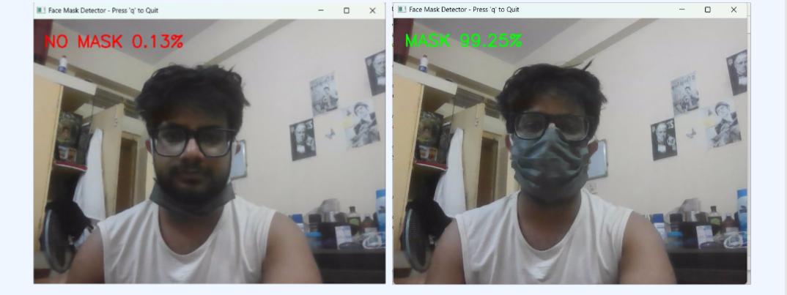
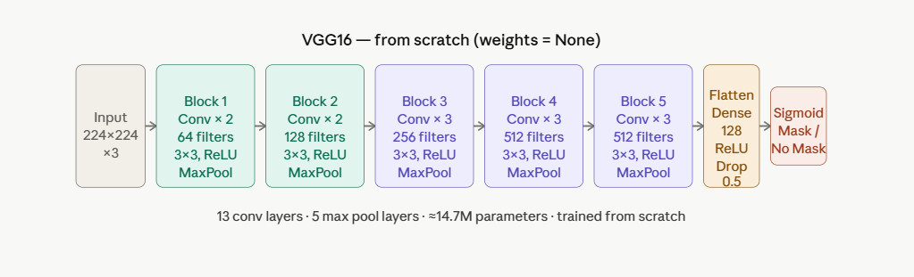
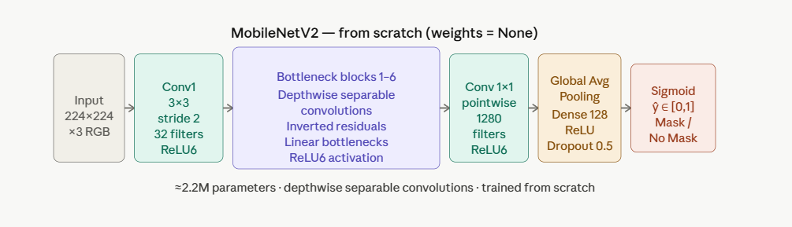
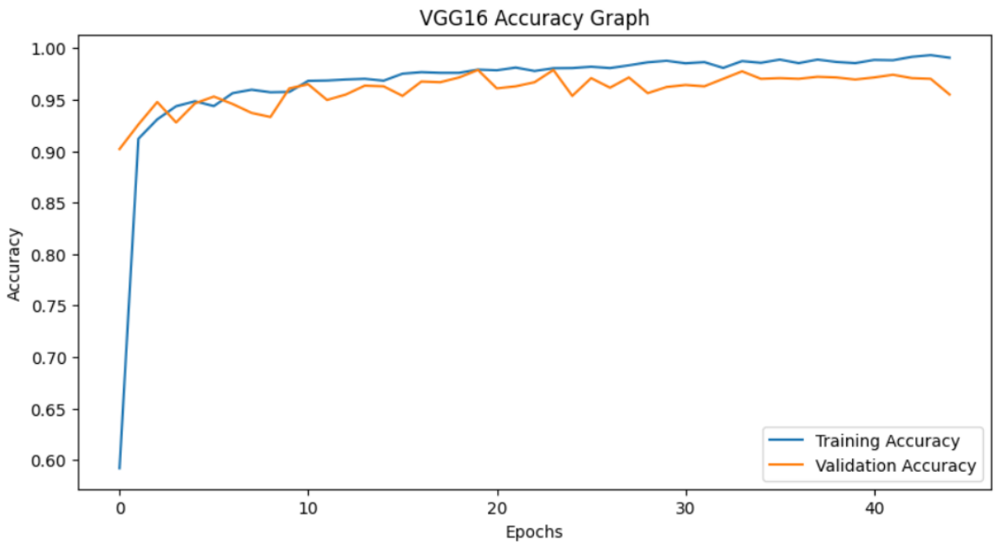
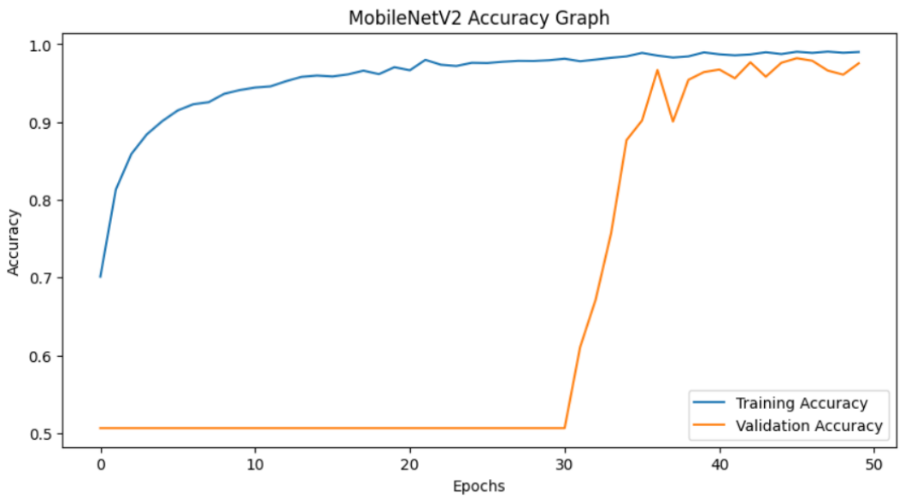
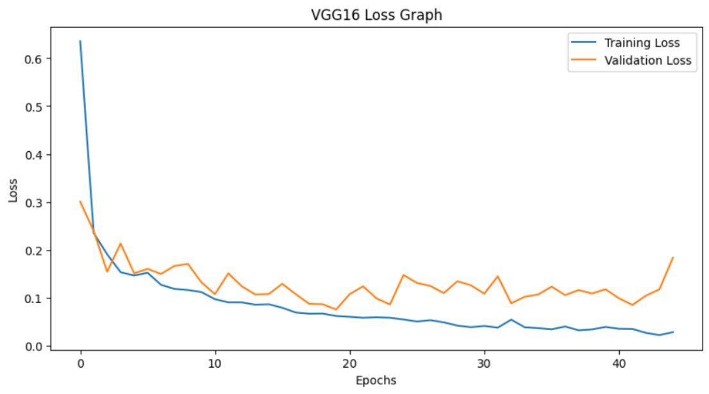
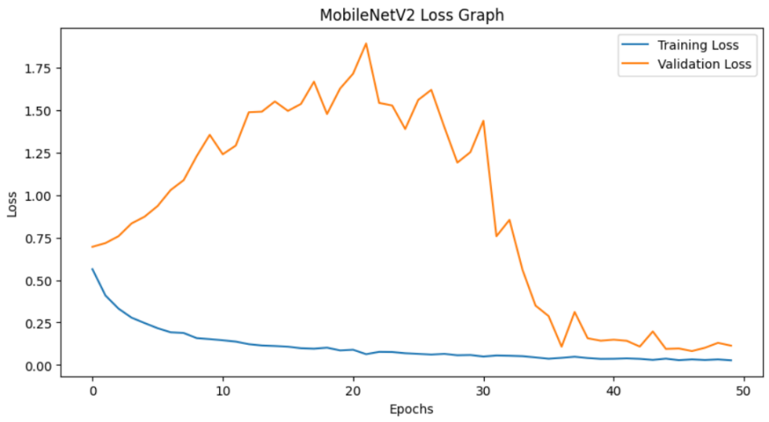

# 😷 Face Mask Detection using Deep Learning

<p align="center">

**A Deep Learning based Face Mask Detection System built from scratch using CNN architectures (VGG16 & MobileNetV2) and deployed as a real-time Streamlit web application.**

</p>

---

## 🎥 Demo

<p align="center">

</p>

---

## 📸 Application Preview

<p align="center">

</p>

---

# 📖 About the Project

This project was developed as part of my **M.Sc. Spring Project** under the guidance of **Prof. Pawan Kumar**, Department of Mathematics, IIT Kharagpur.

The objective is to detect whether a person is wearing a face mask using Deep Learning.

Unlike many existing implementations that rely on Transfer Learning, both **VGG16** and **MobileNetV2** were implemented and trained **completely from scratch**, allowing a detailed comparison of their learning behavior, computational efficiency, and real-time performance.

After experimental evaluation, **MobileNetV2** was selected for deployment due to its lightweight architecture, lower memory consumption, and better suitability for real-time inference.

---

# ✨ Features

- Real-time webcam detection
- Binary Classification (Mask / No Mask)
- VGG16 trained from scratch
- MobileNetV2 trained from scratch
- Model comparison and evaluation
- Confidence score prediction
- OpenCV integration
- Streamlit deployment
- Responsive UI

---

# 🛠 Tech Stack

| Category | Technologies |
|----------|--------------|
| Language | Python |
| Deep Learning | TensorFlow, Keras |
| Computer Vision | OpenCV |
| Deployment | Streamlit |
| Numerical Computing | NumPy |
| Visualization | Matplotlib |

---

# 🔄 Project Workflow

```
Dataset
      │
      ▼
Image Preprocessing
      │
      ▼
Train VGG16
      │
      ▼
Train MobileNetV2
      │
      ▼
Performance Comparison
      │
      ▼
Best Model Selection
      │
      ▼
Streamlit Deployment
      │
      ▼
Real-Time Webcam Detection
```

---

# 📊 Dataset

- Approximately **8,000** labeled images
- Two Classes

```
With Mask
Without Mask
```

Image Size

```
224 × 224 × 3
```

Train / Validation Split

```
80% Training
20% Validation
```

The training pipeline uses **ImageDataGenerator** for efficient preprocessing and out-of-core loading.

---

# 🧠 Model Architectures

## VGG16

- Trained completely from scratch
- No pretrained weights
- 45 Epochs
- ~14.7 Million Parameters

<p align="center">

</p>

---

## MobileNetV2

- Trained completely from scratch
- No pretrained weights
- 50 Epochs
- ~2.2 Million Parameters

<p align="center">

</p>

---

# 📊 Model Comparison

| Feature | VGG16 | MobileNetV2 |
|---------|---------|-------------|
| Parameters | ~14.7M | ~2.2M |
| Epochs | 45 | 50 |
| Training Accuracy | ~99% | ~99.3% |
| Validation Accuracy | ~97% | ~97.5% |
| Memory Usage | High | Low |
| Inference Speed | Moderate | Excellent |
| Deployment | Heavy | Lightweight |

---

# 📈 Training Performance

## Accuracy Comparison

<p align="center">

</p>

<p align="center">

</p>

---

## Loss Comparison

<p align="center">

</p>

<p align="center">

</p>

---

# 🏆 Why MobileNetV2?

Although both models achieved similar validation accuracy, MobileNetV2 was selected because:

- Smaller model size (~2.2M parameters)
- Lower memory consumption
- Faster inference
- Better suited for real-time applications
- More efficient for deployment on edge and mobile devices
- Slightly higher validation accuracy

---

# 🚀 Deployment

The trained MobileNetV2 model was deployed using **Streamlit**.

The application supports:

- Live webcam detection
- Real-time prediction
- Confidence score display
- Simple and responsive interface

---

# 📂 Repository Structure

```
Face-Mask-Detection/
│
├── README.md
├── main.py
├── requirements.txt
├── MobileNetV2_mask_model.h5
├── Face_Mask_Detection.ipynb
├── report.pdf
├── demo.gif
├── home.png
├── accuracy_comparison.png
└── loss_comparison.png
```

---

# ▶️ Run Locally

Clone Repository

```bash
git clone https://github.com/USERNAME/Face-Mask-Detection.git
```

Install Dependencies

```bash
pip install -r requirements.txt
```

Run

```bash
streamlit run main.py
```

---

# 📄 Project Report

A detailed project report describing:

- Dataset
- Data preprocessing
- CNN architectures
- Mathematical formulation
- Training process
- Comparative analysis
- Deployment
- Experimental results

is included in this repository.

---

# 🔮 Future Improvements

- Transfer Learning comparison
- TensorFlow Lite deployment
- Mobile Application
- Face Detection before Classification
- Multi-class Mask Detection
- Edge Device Deployment

---

# 👨‍💻 Author

**Sahil Verma**

M.Sc. Mathematics

Indian Institute of Technology Kharagpur

GitHub : https://github.com/sahilvermahr16-cmyk

LinkedIn : https://www.linkedin.com/in/sahil-verma-990001319/
